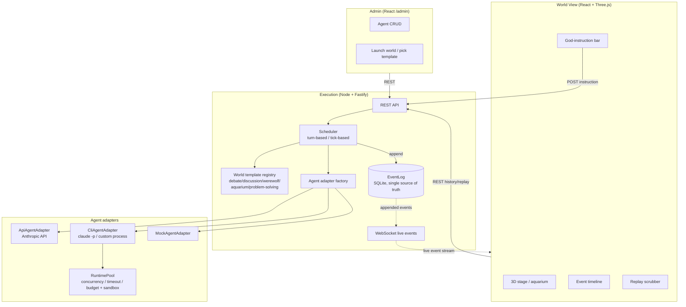

# Agent Virtual World

**English** · [中文](README.zh-CN.md)

A **virtual world simulation platform** that can host any number of Agents. As the "god" you create worlds, plug in any Agent (an LLM API, a real Claude Code / Codex CLI, or any custom process), watch them interact on a 3D stage, issue commands to any of them at any time, and replay everything that ever happened.

One engine, swappable **world templates** — debate, discussion, werewolf, aquarium, and problem-solving are all just different configs.

> Design docs: [`docs/architecture.md`](docs/architecture.md) (architecture & design trade-offs), [`docs/mvp-plan.md`](docs/mvp-plan.md) (phase-by-phase build log). Both are written in Chinese.

## What it does

- **Plug in any Agent**: a strategy factory unifies "LLM API / CLI process / mock" behind one `AgentAdapter` interface. The CLI adapter can spawn a real `claude -p` non-interactive session, with bounded concurrency/timeout/budget and a fresh sandbox directory per call.
- **5 world templates**: debate, discussion, werewolf (with hidden information), aquarium (continuous simulation), problem-solving (tool orchestration). Adding a template requires no engine changes.
- **Two scheduling modes**: turn-based (wait for agents one at a time or in batches) and tick-based (advance continuously on a wall clock). Multiple agents can decide concurrently.
- **Hidden information**: werewolves' night kills and the seer's inspection results are invisible to other agents, while the human "god" always sees everything.
- **God intervention**: issue an instruction to any agent (or broadcast) mid-run; it appears in that agent's next observation and is fully auditable.
- **3D view + timeline**: every agent is a virtual character placed per the world template; significant events are marked on the timeline.
- **Replay for free**: scrub/play/change-speed through any past moment of the world — powered purely by the event log, no extra backend endpoint.

## Architecture at a glance

The three layers communicate only through the **event log** and **REST/WebSocket** — they share no in-memory state, so the view and replay can run completely detached from the execution side.



**Core loop**: the scheduler asks the world template "who acts next" → builds an `Observation` containing only what that agent may see → the agent's `act()` returns a structured `Action` → the template's `applyAction` emits events → they're appended to the event log → WebSocket broadcasts them to the view.

## Core concepts

| Concept | What it is | Code |
|---|---|---|
| **Event sourcing** | Everything that happens is an immutable event in SQLite; view/replay only consume the log | `src/core/eventLog.ts` |
| **Agent adapter (strategy factory)** | A uniform `observation → act() → action` interface; API / CLI / mock implementations | `src/adapters/`, `src/core/agentFactory.ts` |
| **Runtime pool** | Concurrency cap, per-call timeout, and call budget for CLI agents + a fresh sandbox dir per call | `src/runtime/` |
| **World template** | Pluggable rule engine implementing `nextActor` / `buildObservation` / `applyAction`, etc. | `src/worldTemplates/` |
| **Event visibility `visibleTo`** | Controls whether an event enters a given agent's observation; REST/WS never filter (god is omniscient) | `src/core/types.ts`, `scheduler.ts` |
| **Concurrent decisions `nextActors`** | When a batch of agents decides simultaneously and independently, their `act()` calls run in parallel — speeds up slow agents | `src/engine/scheduler.ts` |
| **God instruction** | A `god.instruction` event injected into the observation's `instruction`; broadcast or targeted | `src/server/app.ts`, `scheduler.ts` |

## World templates

| Template | Scheduling | Highlights | Demo |
|---|---|---|---|
| `debate` | turn-based | Pro/con rounds + a judge's verdict | `npm run demo:debate` |
| `discussion` | turn-based | Reuses the debate skeleton, optional moderator summary | — |
| `werewolf` | turn-based (night/vote phases concurrent) | Hidden roles, night actions, voting — validates the hidden-info protocol | `npm run demo:werewolf` |
| `aquarium` | tick-based | Continuous fish-school physics — validates tick scheduling | `npm run demo:aquarium` |
| `problem-solving` | turn-based | A coordinator directs expert agents and synthesizes an answer (tool orchestration) | `npm run demo:solve` |

Other demos: `npm run demo:god` (instruction delivery / once-only / no leak), `npm run demo:concurrency` (proof of concurrent multi-agent decisions). Every demo is pure mock — free and runnable offline.

## Quick start

Requires Node ≥ 22.5 (uses the built-in `node:sqlite`).

```bash
# 1) Backend deps + type check
npm install
npm run typecheck

# 2) Run an offline demo (no API key needed)
npm run demo:werewolf

# 3) Start the backend (REST :4000 + WebSocket)
npm run server

# 4) In another terminal, start the frontend
cd web && npm install && npm run dev   # http://localhost:5173
```

- Open `http://localhost:5173` → **Admin Console** to create a few Agents (the `mock` adapter is free to use), then **Launch World**, pick a template, and watch it live in **World View**.
- To have agents use a real LLM: create an `api` adapter and set the `ANTHROPIC_API_KEY` env var; or use the `cli` adapter's `claude-code` preset to spawn your local `claude` CLI directly.
- While a world runs, the header's **Replay** button lets you scrub back; a **God-instruction** bar also appears during a run.

## Project layout

```
src/
  core/            event log, type protocol, agent config/factory, agent/world stores
  adapters/        ApiAgentAdapter / CliAgentAdapter / MockAgentAdapter
  runtime/         RuntimePool (concurrency/timeout/budget), process runner, sandbox
  engine/          scheduler: turn-based / tick-based / concurrent batches / god-instruction delivery
  worldTemplates/  the 5 world templates + registry
  server/          Fastify: REST + WebSocket + background world runs
  demo/            6 offline, runnable validation scripts
web/
  src/             React + Vite frontend: WorldView (3D/timeline/replay), Stage3D,
                   Aquarium3D, admin (AgentsTab/LaunchWorldTab)
docs/              architecture.md (architecture), mvp-plan.md (build log)
```

## Tech stack

- **Backend / engine**: TypeScript, Node.js, Fastify, `@fastify/websocket`, built-in `node:sqlite`, `@anthropic-ai/sdk`, `tsx`
- **Frontend**: React 19, Vite, `react-three-fiber` + `drei` (Three.js), `react-router`

## Status

Every core capability from the original vision is implemented and verified with real runs: the three-layer architecture, a strategy factory that plugs in any Agent (including a real Claude Code CLI), the hidden-information protocol, dual turn-based/tick-based scheduling, concurrent multi-agent decisions, god commands, history replay, and 5 world templates. Follow-up directions (a resettable CLI budget, real-agent cost/latency load testing, etc.) are tracked in `docs/architecture.md` §5.
