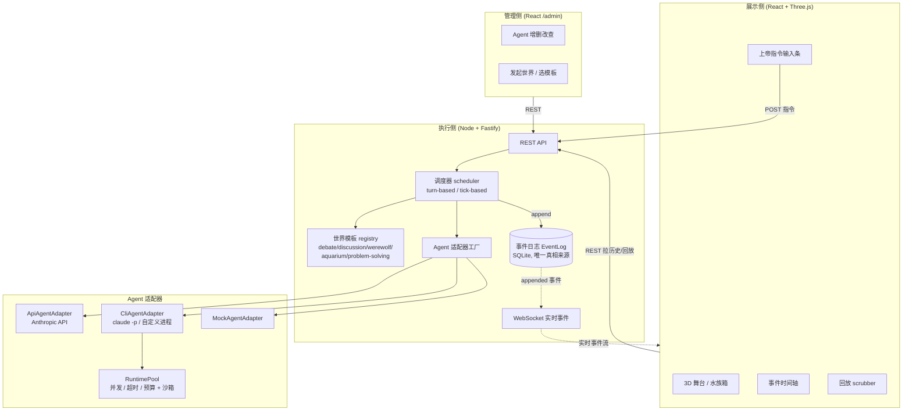

# Agent Virtual World

[English](README.md) · **中文**

一个可容纳任意数量 Agent 的**虚拟世界模拟平台**。你以「上帝」身份创建世界、接入任意 Agent（大模型 API、真实的 Claude Code / Codex CLI、或任何自定义进程），观看它们在 3D 舞台上互动，随时对任意 Agent 发号施令，并回放世界发生过的一切。

同一套引擎通过「世界模板」切换玩法：辩论赛、讨论组、狼人杀、水族箱、做题世界都是换一份配置而已。

> 设计文档：[`docs/architecture.md`](docs/architecture.md)（架构与设计取舍）、[`docs/mvp-plan.md`](docs/mvp-plan.md)（逐阶段实现记录）。

## 它能做什么

- **接入任意 Agent**：策略工厂把「大模型 API / CLI 进程 / mock」统一成一个 `AgentAdapter` 接口。CLI 适配器能真的拉起 `claude -p` 非交互会话，并发/超时/预算受控、每次调用独立沙箱目录。
- **5 个世界模板**：辩论、讨论组、狼人杀（含隐藏信息）、水族箱（连续模拟）、做题世界（工具编排）。加新模板不用改引擎。
- **两种调度**：回合制（等 Agent 逐个/成批响应）与 tick 制（按墙钟节奏连续推进）。多个 Agent 可并发决策。
- **隐藏信息**：狼人的夜间投票、预言家的查验结果对其他 Agent 不可见，但人类「上帝」永远全知。
- **上帝干预**：运行中给任意 Agent（或广播）下达指令，出现在它下一次决策的观测里，全程可追溯。
- **3D 展示 + 时间轴**：每个 Agent 是一个虚拟人物，按世界模板摆位；重大事件在时间轴标注。
- **免费回放**：拖拽/播放/变速回看世界的任意历史时刻——纯靠事件日志，不需要额外后端接口。

## 架构总览

三层通过**事件日志**和 **REST/WebSocket** 通信，互不共享内存状态——因此展示与回放可以完全脱离执行侧。



**核心循环**：调度器问世界模板「该谁行动」→ 为该 Agent 构造只含它可见信息的 `Observation` → Agent `act()` 返回结构化 `Action` → 模板 `applyAction` 产出事件 → 追加进事件日志 → WebSocket 广播给展示侧。

## 核心概念

| 概念 | 说明 | 代码 |
|---|---|---|
| **事件溯源** | 世界发生的一切都是不可变事件，落 SQLite；展示/回放只消费日志 | `src/core/eventLog.ts` |
| **Agent 适配器（策略工厂）** | `observation → act() → action` 统一接口；API / CLI / mock 三种实现 | `src/adapters/`, `src/core/agentFactory.ts` |
| **运行时池** | CLI Agent 的并发上限、单次超时、调用预算 + 每次调用独立沙箱目录 | `src/runtime/` |
| **世界模板** | 可插拔规则引擎，实现 `nextActor`/`buildObservation`/`applyAction` 等 | `src/worldTemplates/` |
| **事件可见性 `visibleTo`** | 控制某事件进不进某 Agent 的观测；REST/WS 从不过滤（上帝全知） | `src/core/types.ts`, `scheduler.ts` |
| **并发决策 `nextActors`** | 一批 Agent 同步、独立决策时并行 `act()`，加速慢 Agent | `src/engine/scheduler.ts` |
| **上帝指令** | `god.instruction` 事件注入观测的 `instruction`，可广播或定向 | `src/server/app.ts`, `scheduler.ts` |

## 世界模板

| 模板 | 调度 | 亮点 | demo |
|---|---|---|---|
| `debate` 辩论赛 | 回合制 | 正反方轮次 + 裁判判定 | `npm run demo:debate` |
| `discussion` 讨论组 | 回合制 | 复用辩论骨架、可选主持人总结 | — |
| `werewolf` 狼人杀 | 回合制（夜/投票阶段并发） | 隐藏身份、夜间行动、投票，验证隐藏信息协议 | `npm run demo:werewolf` |
| `aquarium` 水族箱 | tick 制 | 鱼群连续物理模拟，验证 tick 调度 | `npm run demo:aquarium` |
| `problem-solving` 做题世界 | 回合制 | 协调者指挥专家 Agent、汇总解答（工具编排） | `npm run demo:solve` |

其它 demo：`npm run demo:god`（上帝指令送达/单次/不泄露）、`npm run demo:concurrency`（多 Agent 并发决策证明）。所有 demo 都是纯 mock、免费、离线可跑。

## 快速开始

需要 Node ≥ 22.5（用到内置 `node:sqlite`）。

```bash
# 1) 后端依赖 + 类型检查
npm install
npm run typecheck

# 2) 跑测试，或跑一个离线 demo（无需任何 API key）
npm test
npm run demo:werewolf

# 3) 启动后端（REST :4000 + WebSocket）
npm run server

# 4) 另开一个终端启动前端
cd web && npm install && npm run dev   # http://localhost:5173
```

- 打开 `http://localhost:5173` →「管理控制台」创建几个 Agent（`mock` 适配器免费即用），再「发起世界」选个模板即可在「世界视图」实时观看。
- 想让 Agent 用真实大模型：创建 `api` 适配器并设置 `ANTHROPIC_API_KEY` 环境变量；或用 `cli` 适配器的 `claude-code` 预设直接拉起本机 `claude` CLI。
- 世界运行时，头部的「回放」按钮可拖拽回看；运行中还会出现「上帝指令」输入条。

## 项目结构

```
src/
  core/            事件日志、类型协议、Agent 配置/工厂、Agent/World 存储
  adapters/        ApiAgentAdapter / CliAgentAdapter / MockAgentAdapter
  runtime/         RuntimePool（并发/超时/预算）、进程运行器、沙箱
  engine/          scheduler：turn-based / tick-based / 并发批 / 上帝指令送达
  worldTemplates/  5 个世界模板 + registry
  server/          Fastify：REST + WebSocket + 后台跑世界
  demo/            6 个离线可跑的验证脚本
web/
  src/             React + Vite 前端：WorldView(3D/时间轴/回放)、Stage3D、
                   Aquarium3D、admin(AgentsTab/LaunchWorldTab)
docs/              architecture.md（架构）、mvp-plan.md（实现记录）
```

## 技术栈

- **后端 / 引擎**：TypeScript、Node.js、Fastify、`@fastify/websocket`、内置 `node:sqlite`、`@anthropic-ai/sdk`、`tsx`
- **前端**：React 19、Vite、`react-three-fiber` + `drei`（Three.js）、`react-router`

## 状态

最初设想的全部核心能力都已实现并用真实运行验证：三层架构、策略工厂接入任意 Agent（含真实 Claude Code CLI）、隐藏信息协议、回合/tick 双调度、多 Agent 并发、上帝发号施令、历史回放，以及 5 个世界模板。后续方向（可重置的 CLI 预算、真实 Agent 成本/延迟压测等）见 `docs/architecture.md` §5。
